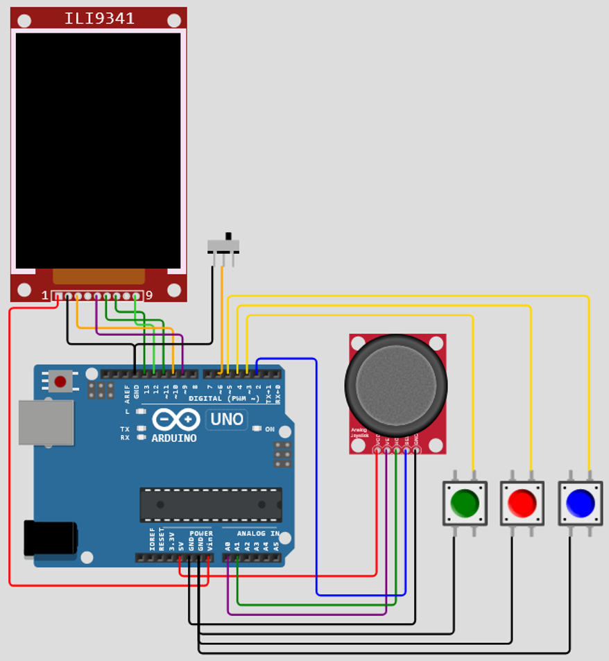

# Course Project: Go & Sudoku Mind Games

## Overview  
This project is a course assignment that involves designing and building an Arduino-based device capable of simulating both Go and Sudoku games. The device reads player moves, enforces game rules, and displays gameplay on a screen as interactive puzzles to exercise the mind.

## Project Demo

<b>Click to expand</b>

Schematic layout

Menu game selection demo

Sudoku (easy) game demo

Sudoku (medium) game demo

Sudoku (hard) game demo

Go game demo

## Features  
- Simulates Go and Sudoku gameplay  
- Reads player input via buttons and joystick  
- Generates Sudoku puzzles of varying difficulty  
- Enforces game rules and move validation  
- Displays game state and prompts on an ILI9341 color TFT screen  
- Supports turn-based gameplay and error highlighting  

## Technologies Used  
- **Hardware**: Arduino Uno, ILI9341 TFT display, analog joystick, push buttons  
- **Software**: C++ programming for Arduino 
- **Interface**: SPI for display, analog inputs for joystick, digital I/O for buttons  

## Used Libraries

- **Adafruit ILI9341** — a library for working with the ILI9341 display, providing graphics and text rendering on a TFT screen.
- **SimpleStack** — a simple library for implementing a stack data structure in the project.

## How to Build and Run  

### 1. Hardware Setup  

  
Hardware Pinout (click to expand)

#### TFT Display (ILI9341)

| Display Pin | Arduino Pin |
|-------------|-------------|
| VCC         | Vin         |
| GND         | GND         |
| CS          | D10         |
| D/C         | D9          |
| MOSI        | D11         |
| SCK         | D13         |
| MISO        | D12         |

#### Analog Joystick

| Joystick Pin | Arduino Pin |
|--------------|--------------|
| VCC          | 5V           |
| VERT (Y)     | A0           |
| HORZ (X)     | A1           |
| SEL (button) | D2           |
| GND          | GND          |

#### Push Buttons

| Color   | Arduino Pin |
|---------|-------------|
| Green   | D3          |
| Red     | D4          |
| Blue    | D5          |

_All buttons share GND._

### 2. Upload Code  
- Open the Arduino IDE.  
- Upload the project code (C++) to your Arduino Uno.  
- Verify wiring matches the tables above.  

You can also run and test the project online using the [Wokwi Simulator](https://wokwi.com/projects/381573727114961921).

### 3. Controls  
- **Main Menu**: Select between Go and Sudoku  
- **Sudoku**: Solve puzzles of 10 (easy), 20 (medium), or 30 (hard) filled cells  
- **Go**: Use joystick to move, press button to place a stone  
- Errors or invalid moves will be highlighted on screen  
